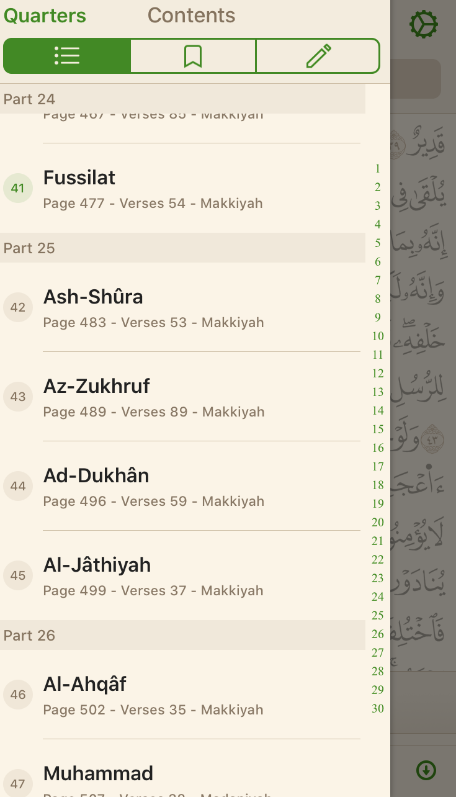

## Sample apps

* [Ayat](https://quran.ksu.edu.sa/ayat/?l=en)
* [Ayah](http://ayahapp.com/)
* [Quran Apps](https://quran.com/apps)
* [Quran Academy](https://quranacademy.io/apps)

## Quran page
Upon app starting it will previously reading Quran page or first page.

## Tapped
If user taps on page it should show

On bottom slider user can slide through numbers of Quran pages (1...604). Slider's current value will be current page.

On top left menu button they can access side menu pop-over.

On top title Surah name, ayah number, Juzz.

## Sidemenu

On sidemenu Surah, Juzz and page can be selected.

## Translition

On second version from bottom translation will be showed.

